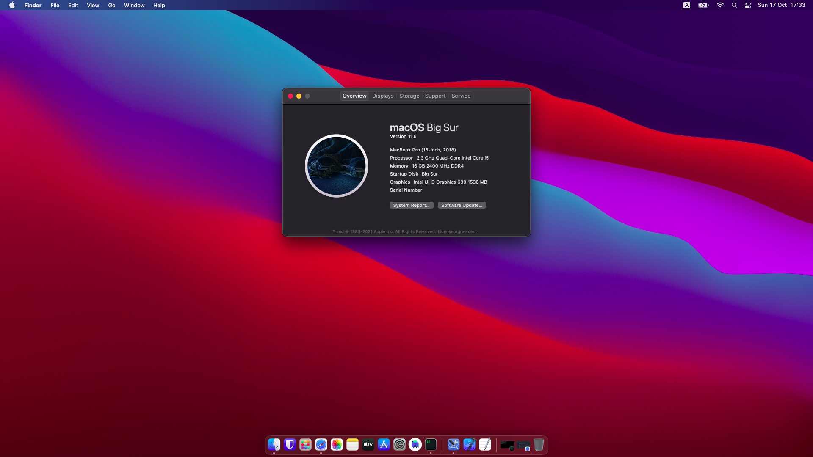

# HP Pavillion Gaming Laptop 15-cx0124tx

## Monterey 12.0.1
 

## Big Sur 11.6 __*Deprecated*__
 

## Working
- Power management
- Hibernate sleep ** __*Only Monterey*__
- Intel graphic card
- Touchpad
- Audio
- Ethernet
- USB ports
- Wi-Fi
- Bluetooth ** __*Monterey some time can't open*__
- Web camera

## Important

- when update os in system update
- you must be disable SIP
- Go to NVRAM > ADD > 7C436110-AB2A-4BBB-A880-FE41995C9F82
- set csr-active-config from 00000000 to 03000000 before update
- after update you set back to 00000000 for security
- for more info read this guide [https://dortania.github.io/OpenCore-Install-Guide/troubleshooting/extended/post-issues.html#disabling-sip](https://dortania.github.io/OpenCore-Install-Guide/troubleshooting/extended/post-issues.html#disabling-sip)

## Not Working
- Nvidia graphic card
- Card reader
- HDMI port
